## <MBTI 기반 데이트 장소 추천 플랫폼>

### 추천 로직을 신뢰할 수 있게 전달하는 상태·흐름 중심

## 1. 프로젝트 개요

본 프론트엔드는
MBTI 기반 데이트 장소 추천 플랫폼의 사용자 인터페이스를 담당하며,

MBTI 컨텍스트 상태 관리

추천 → 상세 → 반응으로 이어지는 사용자 흐름 제어

백엔드 추천 도메인을 정확하게 소비하는 역할

에 초점을 맞추어 설계되었습니다.

단순 화면 구현이 아닌,
추천 신뢰도를 깨뜨리지 않는 상태 관리와 데이터 흐름 제어를 핵심 목표로 합니다.

## 2. 기술 스택

- React (Vite)
- TypeScript
- react-router-dom
- styled-components
- Zustand
- @tanstack/react-query
- Axios

## 3. 프론트엔드 역할 정의

프론트엔드는 다음 책임을 가집니다.

- 사용자 MBTI 기준(본인 / 상대)을 전역 상태로 일관되게 유지

- 추천 흐름에서 발생하는 모든 사용자 행위를 명확한 상태 전이로 관리

- 서버 추천 결과를 왜곡 없이 UI로 표현

추천 로직의 핵심은 서버에 있지만,
추천 흐름의 안정성은 프론트에서 보장한다는 관점으로 설계했습니다.

## 4. 전역 상태 설계

MBTI Context 상태 :
export type MbtiContext = "SELF" | "PARTNER";

추천, 클릭, 좋아요, 북마크 등 모든 사용자 행동은
반드시 MbtiContext를 포함

UI 토글과 API 요청 파라미터를 단일 소스로 동기화

Context 변경 시 추천 쿼리를 명확히 분리

### 1. 설계 의도

MBTI 기준이 흔들리면 추천 결과의 의미가 사라지기 때문에
프론트 전역에서 강제 관리하도록 설계했습니다.

## 5. 인증 상태 관리

- OAuth 로그인 후 JWT 발급
- accessToken을 localStorage에 저장
- Zustand + persist 미들웨어로 로그인 상태 유지
- Axios 인터셉터를 통해 인증 헤더 자동 주입

## 6. 추천 페이지 아키텍처 (핵심)

### RecommendPage

├─ SearchBar // 위치·카테고리 입력

├─ ContextSelector // SELF / PARTNER 전환

├─ RecommendList // 추천 결과 리스트

├─ PlaceDetailCard // 장소 상세

- 각 컴포넌트는 자기 책임만 수행
- 서버 상태는 react-query로만 관리
- UI 컴포넌트는 서버 상태를 소유하지 않음

### 추천 흐름 제어

- 검색 조건 입력 → 추천 API 요청 → 추천 리스트 렌더링
- 장소 선택 → 상세 정보 조회 → 좋아요 / 북마크 반응

관련 쿼리 invalidate → 추천 결과 재계산

## 7. 핵심 설계 포인트

사용자 행동이 발생하면
추천 결과에 즉시 반영되는 흐름을 유지하도록 구성했습니다.

### 🔄 서버 상태 관리 전략 - react-query 사용 이유

추천 결과는 항상 서버 기준 데이터

캐시 무효화 전략이 명확해야 함

불필요한 전역 상태 제거

useQuery({
queryKey: ["recommend", context, params],
queryFn: fetchRecommendPlaces,
});

좋아요/북마크 발생 시 관련 쿼리만 선택적으로 invalidate

추천 계산 결과의 일관성 유지

### 🧩 타입 설계 전략

백엔드 Response DTO 기준으로 타입 정의

프론트 단에서 의미 추론 최소화

서버 스펙 변경 시 타입 오류로 즉시 감지

export interface PlaceDetailResponse {
id: number;
name: string;
rating: number;
myReaction: "LIKE" | null;
bookmarked: boolean;
}

### 🎨 스타일링 전략

styled-components 사용

페이지 단위 스타일 파일 분리

반응형 레이아웃 고려

추천 페이지 레이아웃 흔들림 방지 처리

### 🧪 UX 설계 포인트

추천 로딩 상태 명확화

반응 버튼 즉각적인 시각 피드백

상세 카드 열림/닫힘 시 화면 너비 고정

Context 전환 시 상태 불일치 방지

## 8. 프론트에서 해결한 주요 문제

### 1. 추천 페이지 레이아웃 흔들림

상세 카드 오픈 시 스크롤·너비 고정 처리

### 2. MBTI Context 전환 시 데이터 불일치

Context 변경 시 쿼리 키 분리

이전 추천 결과 캐시와 완전 분리

### 🧪 테스트 전략

본 프로젝트는 UI 단위 테스트보다는

추천 흐름의 정상 동작

MBTI Context 전환 시 데이터 일관성

사용자 반응 후 추천 결과 반영 여부

등 비즈니스 흐름 중심의 테스트를 수행했습니다.

타입 안정성을 통해 런타임 오류를 사전에 차단하는 전략을 채택했습니다.

### 🚀 향후 개선 계획

추천 결과 애니메이션 개선

추천 이유 시각화 UI

접근성(ARIA) 개선

통계 시각화

## 웹 UI Preview

### Login

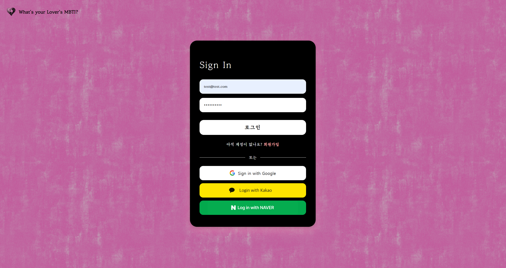

### Home

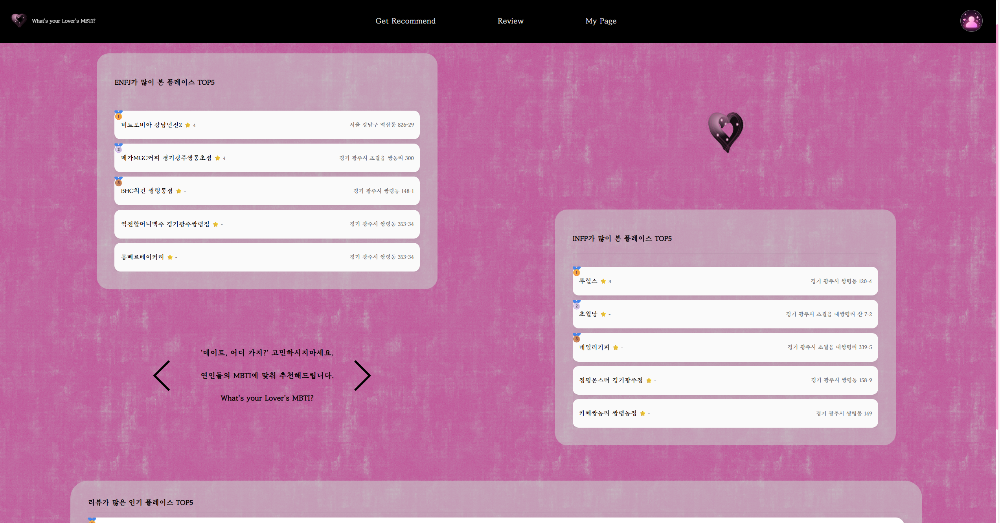

### Recommend

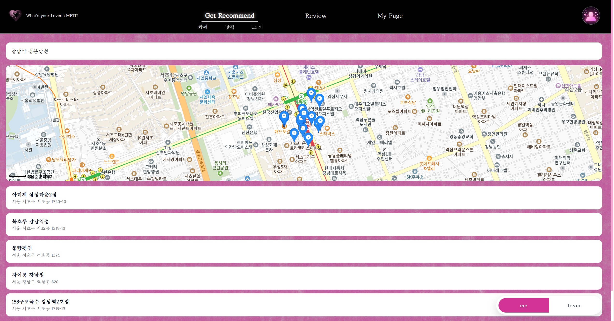

### Place Detail

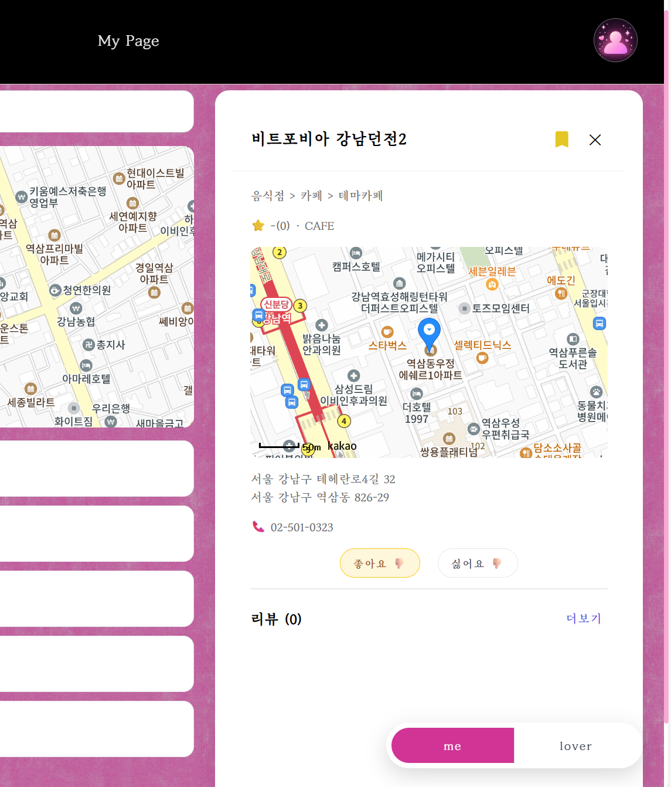

### Place Detail Drawer

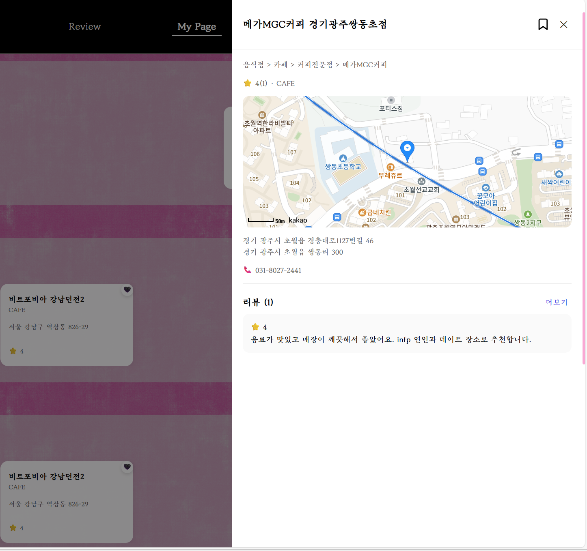

### Review

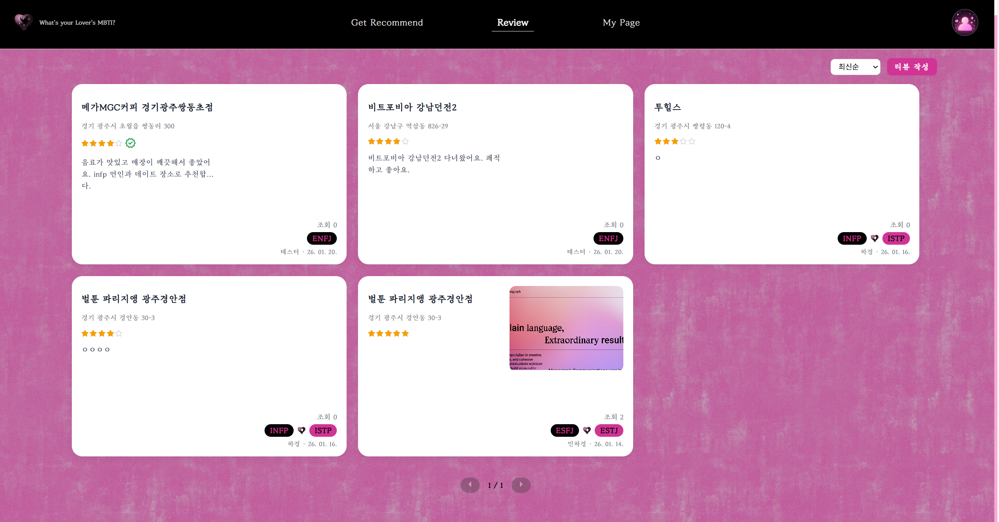

### ReviewWriteModal

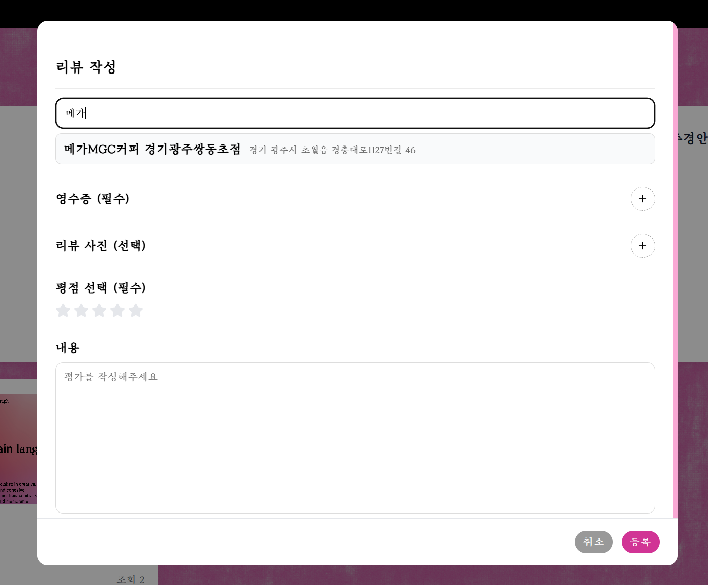

### MyPage

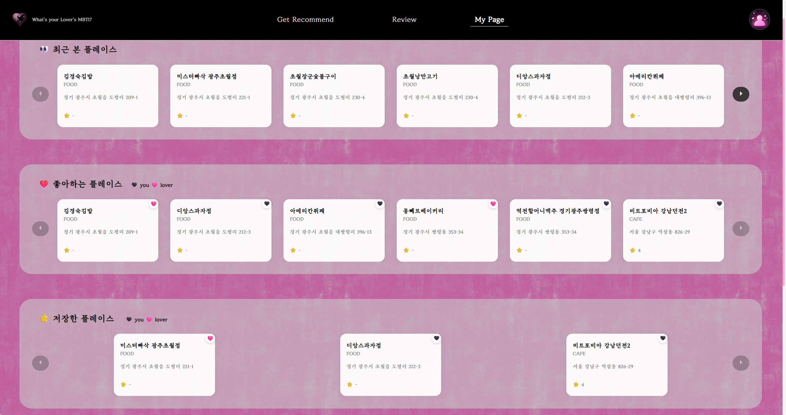

### ProfileEdit

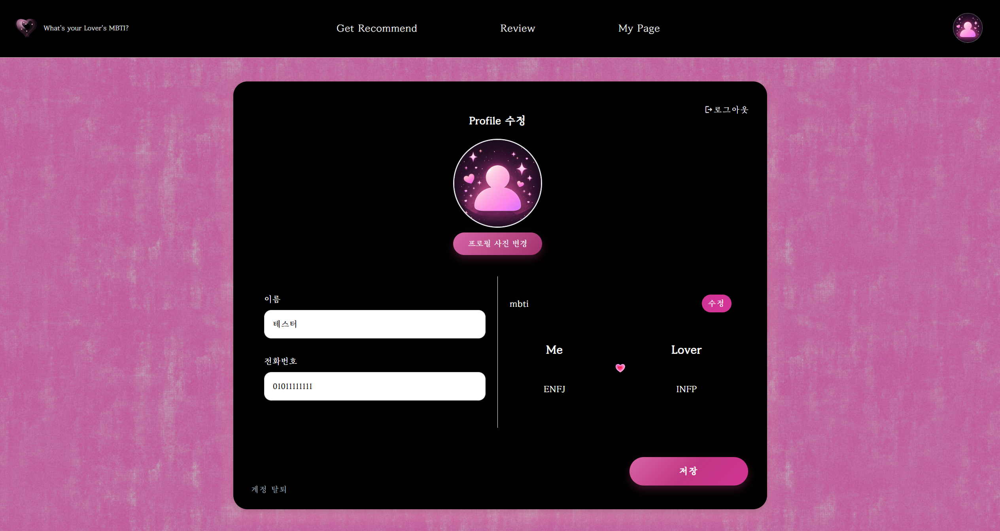
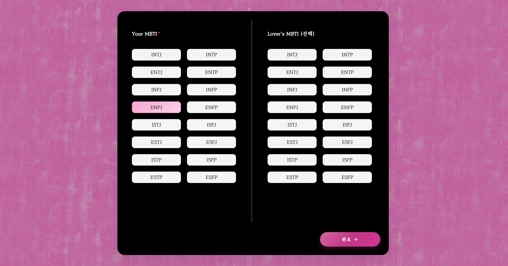

## 모바일 UI Preview

### Recommend

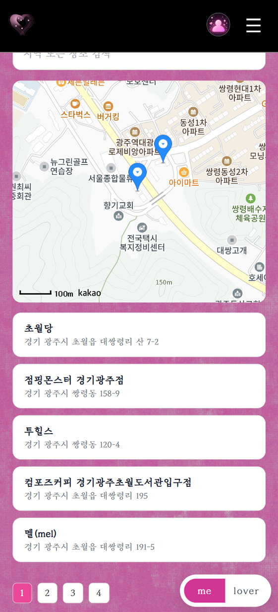

### Menu

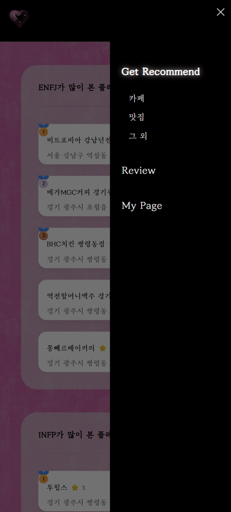
